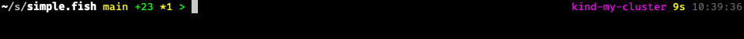

# simple.fish

A fish prompt that stays out of your way.

One line. Plain ASCII. Pure fish. Async — never blocks your shell.



## Why

Most prompts either pile on glyphs you don't need or stall the shell while they
shell out to `git status`. This one shows the bare minimum, runs the slow stuff
in the background, and never makes you wait for a key to register.

## Install

With [fisher](https://github.com/jorgebucaran/fisher):

```fish
fisher install RWejlgaard/simple.fish
```

Or symlink the `conf.d/` and `functions/` directories into `~/.config/fish/`.

Requires fish 3.5+.

## What you get

**PWD** — leftmost segments shrunk to shortest unique prefix. Last segment
and git root stay bold and full-length. Tab-completion still works on the
truncated form because each shortened piece is a unique prefix in its parent.

**Git** — branch (or tag, or short SHA when detached). Counts for staged (`+`),
modified (`*`), untracked (`?`), deleted (`-`), stashed (`$`), conflicts (`!`).
Ahead (`^N`) and behind (`vN`) — shown together when diverged. If the branch
has no upstream, ahead counts commits not present on any remote (i.e. unpushed).
Computed async.

**Languages** — node, python, ruby, go, rust, java, php. Version shown only
when the project actually uses that language (package.json, go.mod, etc).

**Cloud** — aws profile, gcloud config, kubectl context, terraform workspace,
docker context. Only when relevant. (kubectl context shows whenever one is
set; the rest are gated on env vars or project files.)

**Environment** — direnv, nix-shell, distrobox/toolbox/container, private
mode, SHLVL > 1, background jobs.

**Status** — exit code of last command (with signal name, e.g. `SIGINT`),
duration (only when slow), wall-clock time. SSH/root shows `user@host`.

The prompt char is `>` (green), `>` red on non-zero exit, `#` red as root.

## Async, the only way

The slow bits (git, language versions, cloud configs) run in a backgrounded
fish block. When they finish, the worker signals the shell with `SIGUSR1` and
the prompt repaints. The first prompt in a new directory shows without git
info for a few hundred ms, then fills in. You never wait on a keystroke.

State is recomputed only when it could have changed — on `cd` or after a
command runs. Repaint-only events (keystrokes) read from cache.

## Configuration

Set any of these in `config.fish`. All optional.

```fish
set -g simple_duration_threshold 3000     # ms; show duration when slower
set -g simple_show_time 1                 # 0 to hide
set -g simple_time_format "+%H:%M:%S"
set -g simple_show_jobs 1
set -g simple_show_shlvl 1
set -g simple_show_context auto           # auto | always | never

# Override symbols if you want flair
set -g simple_char_prompt '>'
set -g simple_char_root   '#'
set -g simple_char_ahead '^'
set -g simple_char_behind 'v'
set -g simple_char_staged '+'
set -g simple_char_modified '*'
set -g simple_char_untracked '?'
set -g simple_char_deleted '-'
set -g simple_char_stashed '$'
set -g simple_char_conflicts '!'
```
